# APAC C&C GenAI Sub-practice - Bootcamp 1 - Lab 1

## Lab 1 Overview

In this lab, you will:

1. Create an AEM Edge Delivery Services (EDS) site, using Document Authoring (DA) for the  content authoring method.
2. Harden DA to restrict authoring to only an admin + specific users from an IMS group.
3. Harden EDS to restrict preview and publishing to only an admin + specific users from an IMS group.
4. Utilize App Builder to create runtime actions that will leverage the [UMAPI API](https://developer.adobe.com/umapi/) and the [AEM Admin API](https://www.aem.live/docs/admin.html) to automate the hardening of preview and publishing permissions to users from a specific IMS group.

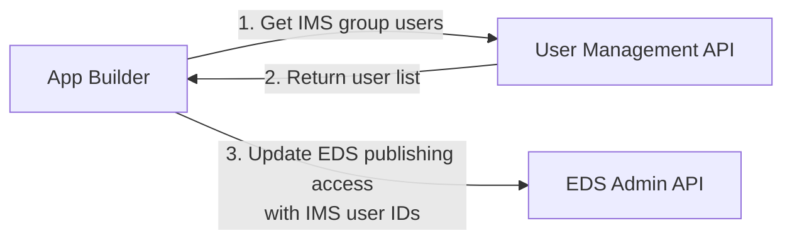

## Key Resources

### AEM Edge Delivery Services (EDS)
- [EDS Getting Started Tutorial](https://www.aem.live/developer/tutorial) - Complete setup guide
- [EDS Admin API](https://www.aem.live/docs/admin.html) - API for managing site permissions
- [EDS User Admin Tool](https://tools.aem.live) - Web UI for managing site access

### Document Authoring (DA)
- [DA Authoring Interface](https://da.live) - Content editing platform
- [DA Permissions Guide](https://docs.da.live/administrators/guides/permissions) - Configure user access and roles

### Adobe App Builder
- [Getting Started with Runtime](https://developer.adobe.com/app-builder/docs/get_started/runtime_getting_started) - App Builder basics
- [Node.js Runtime Versions](https://developer.adobe.com/app-builder/docs/guides/runtime_guides/reference_docs/runtimes) - Supported Node.js versions
- [Developer Console](https://developer.adobe.com/console) - Create and manage App Builder projects

### User Management API (UMAPI)
- [UMAPI Overview](https://developer.adobe.com/umapi/) - Getting started with User Management API
- [UMAPI Documentation](https://adobe-apiplatform.github.io/umapi-documentation/en/) - Complete API reference

### GitHub Resources
- [AEM Boilerplate Template](https://github.com/adobe/aem-boilerplate) - Starter template for EDS sites
- [AEM Code Sync App](https://github.com/apps/aem-code-sync) - Required GitHub app for EDS integration

## Prerequisites

### Install Node.js and npm

Node.js version 20.7.0 or higher is required for Adobe App Builder. npm comes bundled with Node.js.

> **Note:** Adobe App Builder officially supports the three latest Node.js versions (20, 22, 24). See [official runtime documentation](https://developer.adobe.com/app-builder/docs/guides/runtime_guides/reference_docs/runtimes) for the current supported versions.

#### Mac Installation

**Option 1: Using Homebrew (Recommended)**

```bash
# Install Homebrew if you don't have it
/bin/bash -c "$(curl -fsSL https://raw.githubusercontent.com/Homebrew/install/HEAD/install.sh)"

# Install Node.js (includes npm)
brew install node@20

# Verify installation
node --version
npm --version
```

**Option 2: Using Official Installer**

1. Go to [https://nodejs.org/](https://nodejs.org/)
2. Download the LTS (Long Term Support) version for macOS
3. Run the installer and follow the prompts
4. Open Terminal and verify:

```bash
node --version
npm --version
```

#### Windows Installation

**Using Official Installer**

1. Go to [https://nodejs.org/](https://nodejs.org/)
2. Download the LTS (Long Term Support) version for Windows
3. Run the `.msi` installer
4. Follow the installation wizard (use default settings)
5. Open Command Prompt or PowerShell and verify:

```bash
node --version
npm --version
```

**Note:** You may need to restart your terminal/command prompt after installation for the commands to be recognized.

### Install Adobe I/O CLI (aio)

Install the `aio` CLI globally using npm:

```bash
npm install -g @adobe/aio-cli
```

Verify the installation:

```bash
aio --version
```

> See the [official setup guide](https://developer.adobe.com/app-builder/docs/get_started/runtime_getting_started/setup) for more details on configuring the CLI.

## Create Document Authoring (DA) and Edge Delivery Services (EDS) AEM project

Go to https://www.aem.live/

Click **Create your site**

You end up here https://www.aem.live/developer/tutorial.  Follow this tutorial.

### Create a new chrome profile

For the interests of the lab, please create a new chrome profile.

### Create a new gmail account

For the interests of the lab, please create a new gmail account.

### Create a new github account

For the interests of the lab, please create a github account.

### Create boilerplate GitHub repo

Sign in to github account.

Clone the boilerplate GitHub repo [https://github.com/adobe/aem-boilerplate](https://github.com/adobe/aem-boilerplate)

Click the `Use this template button` and select `Create a new repository`, and select the user org that owns the repository


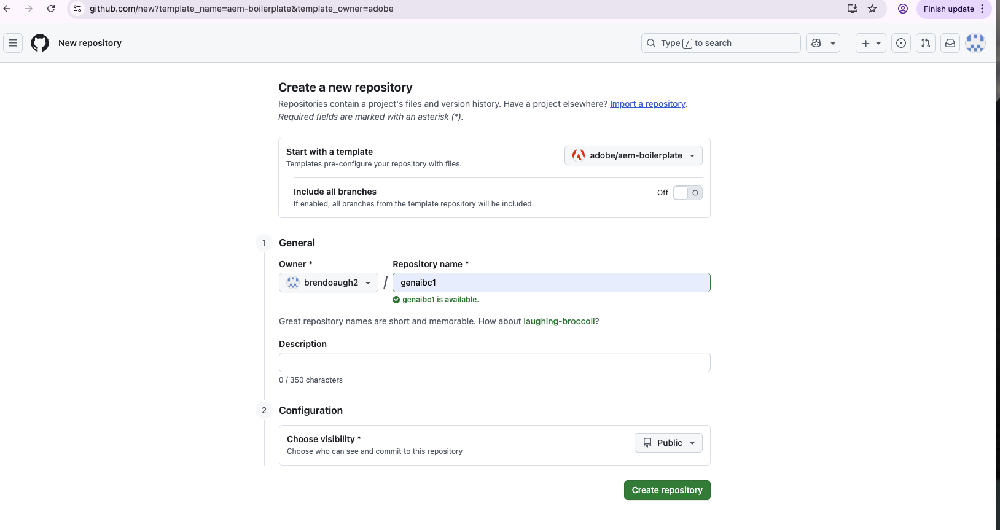


Set repo to public.

Click Create repository

### Install AEM Code Sync

Install the [AEM Code Sync](https://github.com/apps/aem-code-sync) on your repository.
    


In the `Repository access` settings of the AEM Code Sync App, make sure you select `Only select Repositories` (not `All Repositories`). Then select your newly created repository, and click `Save`.


Congratulations! You have a new EDS website running on `https://<branch>--<repo>--<owner>.aem.page/`.  Check it is running.  In the example above that’s https://main--genaibc1--brendoaugh2.aem.page and https://main--genaibc1--brendoaugh2.aem.live


### What Just Happened: EDS Organization Setup

As part of the process you just followed, an `aem.live` EDS org with the same name as your `github.com` org was created, and the github.com user who added the AEM Code Sync App will be added as admin.

> See the [EDS Organization Setup Guide](https://www.aem.live/docs/config-service-setup#create-your-organization) for more details.

**Configuration Service** - It's important to know that there is a [Configuration Service](https://www.aem.live/docs/config-service-setup) used to manage various configurations in the EDS architecture. Common configuration tasks can be achieved using the [User Admin Tool](https://tools.aem.live/), however the same configuration can also be managed via the [AEM Admin API](https://www.aem.live/docs/admin.html#tag/orgConfig).

### Edit, Preview and Publish Content in Document Authoring

Navigate to `https://da.live/#/<GITHUB_USER_ID>` e.g. `da.live/#/bootcamp392`

You will see your new DA site listed


Click into this site


Edit the index page content.  For more information on authoring see https://da.live/docs.


Preview and Publish


You will see preview content pushed to the `.page` EDS site and published content pushed to `.live` EDS site.


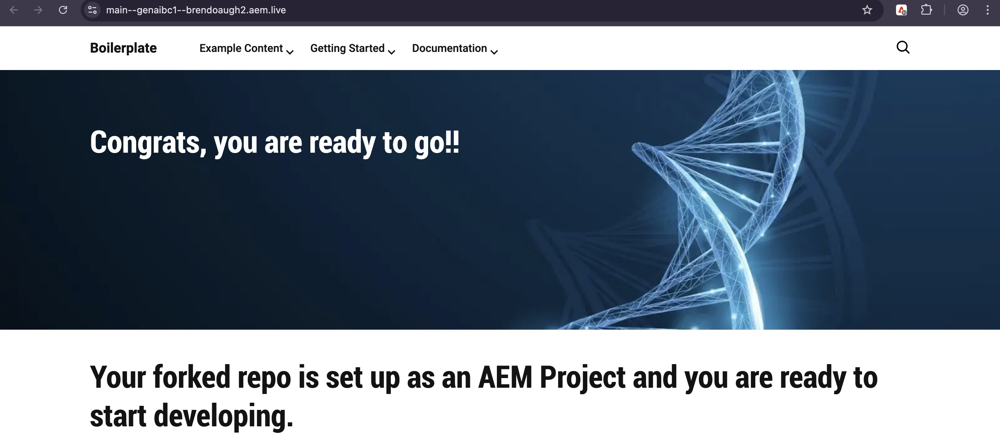

### What Just Happened: DA and EDS Permissions

At this point, any user can log in to DA and author content for this site. Additionally, any user can preview and publish content to EDS.

To prove this, ask one of your bootcamp colleagues to browse to your DA authoring URL, update content and then try to preview and publish. They will be able to!

For an overview of the EDS ecosystem of access control, read https://docs.da.live/administrators/guides/permissions and https://docs.da.live/administrators/guides/permissions#a-common-pitfall

The key concept here is that:

> - **Ability to author content** - This access control is handled by DA or Java-based AEM.
> - **Ability to preview content** - This access control is handled by Edge Delivery Services.
> - **Ability to publish content** - This access control is handled by Edge Delivery Services.
> - **Ability to view content** - This access control is handled by Edge Delivery Services.

## Harden EDS and DA permissions

### Setup and limit the ability to preview and publish to EDS

#### Obtain your auth token in order to use the AEM Admin API

> For background read the following https://www.aem.live/docs/admin.html#tag/authentication

Navigate to https://admin.hlx.page/login


Follow the link to `login_adobe` ie. https://admin.hlx.page/auth/adobe

> **Important:** At this point, the only admin user for your EDS org is the GitHub user who installed the AEM Code Sync App (as mentioned earlier). You must sign in with an Adobe account that corresponds to this GitHub user. If you don't have a matching Adobe account, you will need to create one.

Once logged in you will see a result like below


Go to your browner's developer tools.  Under `Application` > `Cookies` > you will see the `auth_token`.  Copy this value somewhere safe.


#### Confirm current EDS site access

Perform the following via curl, where

- <ORG> is your EDS org created above (same as your GitHub org name).
- <SITE> is your EDS site that was created above (same as your repo name).
- <AUTH_TOKEN> is the `auth_token` from the previous step.

```
curl 'https://admin.hlx.page/config/<ORG>/sites/<SITE>/access.json' \
--header 'x-auth-token: <AUTH_TOKEN>'
```

The response should look something like this

```
{
  "admin": {
    "role": {
      "admin": [
        "helix-setup@adobe.com"
      ]
    },
    "requireAuth": "false"
  }
```

What this is showing is that there is no authentication set for preview and publish permission for this EDS site, which is why above any user can preview and publish from DA to EDS.

#### Restrict preview and publishing to EDS site for all

Perform the following via curl to turn `requireAuth` on.

```
curl --location 'https://admin.hlx.page/config/<ORG>/sites/<SITE>/access.json' \
--header 'x-auth-token: <AUTH_TOKEN>' \
--header 'Content-Type: application/json' \
--data-raw '{
    "admin": {
        "role": {
            "admin": [
                "helix-setup@adobe.com"
            ]
        },
        "requireAuth": "true"
    }
}'
```

Go back to da.live and attempt to publish the index page.  You should receive a non-authorized error

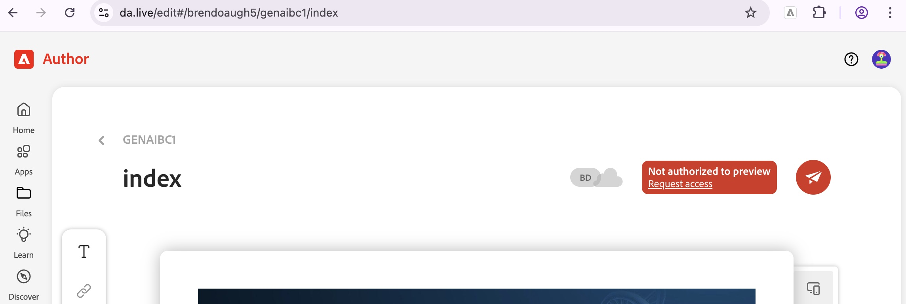

#### Grant yourself preview and publish permissions

##### Get your IMS userid

1. Visit da.live in your browser.
2. Sign in (if you are not already)
3. Open the profile menu from the top right
4. Click your name, this will copy your IMS userid.
6. Paste the copied userid somewhere safe.

> It will be in format e.g. `EA8A4749H4GK99IHO495FA1@AdobeID`


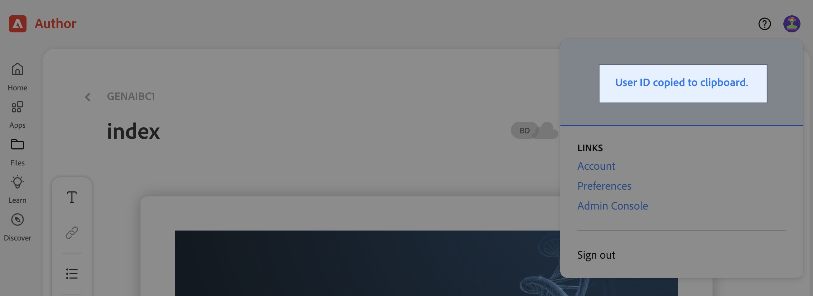

##### Update EDS site access config

Perform the following via curl.  Ensure to include the IMS User id from the previous step where shown below

```
curl 'https://admin.hlx.page/config/<ORG>/sites/<SITE>/access.json' \
--header 'x-auth-token: <AUTH_TOKEN>' \
--header 'Content-Type: application/json' \
--data-raw '{
    "admin": {
        "role": {
            "admin": [
                "helix-setup@adobe.com"
            ],
            "publish": [
                "<IMS_USERID>"
            ]
        },
        "requireAuth": "true"
    }
}'
```

Go back to da.live and attempt to publish the index page.  You should now be able to do so successfully! ✅🙂

For the negative test, login to DA in another browser profile with another user or ask your bootcamp colleague to try publish your site via DA again.  The non-authorized error should appear.

> For concepts please read https://www.aem.live/docs/config-service-setup#update-access-control and https://www.aem.live/docs/authentication-setup-authoring

We have now explored how to harden EDS preview and publish access for a single user.  Later, we will perform this at scale using App Builder!

### Setup and limit the ability to author content in DA

Now we have restricted EDS preview and publishing permissions, all users are still able to author content in DA!  In this section we will explore hardening this access.

> For concepts please read -> https://docs.da.live/administrators/guides/permissions#ability-to-author-content

#### Get your IMS Organization ID.
Use Admin Console to get your IMS organization ID.

> The ID for `acs-apac-internal` is `09CF60665F98CEF90A495FF8`

#### Get your identity email address

This is the same email address you used to login to DA


#### Populate DA permissions sheet

Go to (https://da.live/config#/<ORG_ID>/) and add the following configuration.

> IMPORTANT!! Ensure you put you email address into the permissions sheet below for rows `CONFIG` and `/ + **`.  If you don't you will nuke your access! ☢️

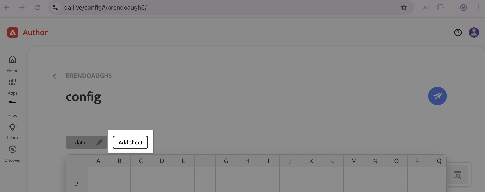

1. Add a sheet called `Permissions`.
2. Add columns `path`,  `groups` and `actions`
3. Add four rows as below 

> These are based on the recommended structure outlined here -> https://docs.da.live/administrators/guides/permissions#permissions-sheet

| **path** | **groups** | **actions** |
| -------- | ---------- | ----------- |
| CONFIG | `09CF60665F98CEF90A495FF8` | read |
| CONFIG | `<EMAIL>` | write |
| / + ** | `09CF60665F98CEF90A495FF8` | read |
| / + ** | `<EMAIL>` | write |

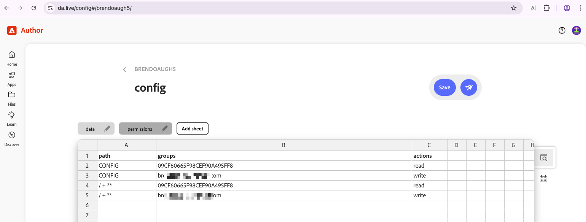

3. Click Save (paper plane)

#### Confirm now that others cannot author content in DA

Now that we have hardened DA permssions, login to DA in another browser profile with another user or ask your bootcamp colleague to try author and save changes to content in DA again.  They should not be able to.

There should be a padlock 🔒 icon appear on the DA page

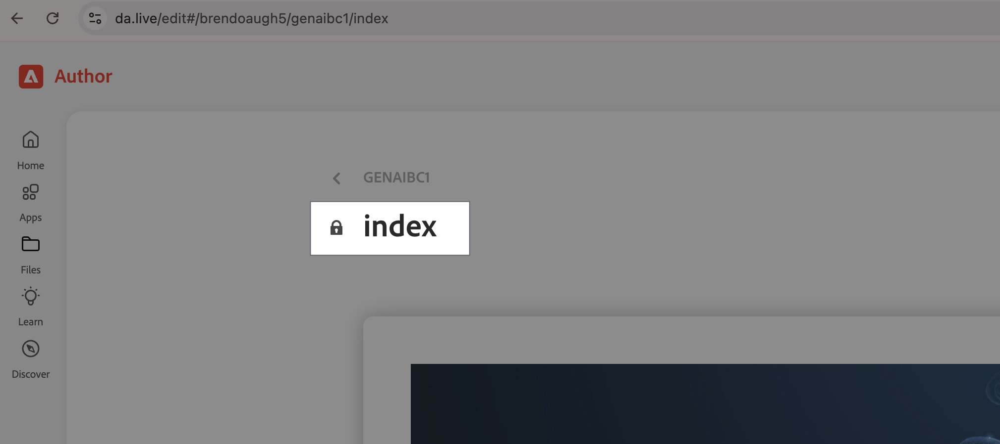

We have now explored how to harden DA content editing access for a single user.  Later, we will perform this at scale using App Builder!

#### Open up DA permissions to Bootcamp users group

With AppBuilder in the next section we will be automating EDS preview and publish permissions, not DA permissions.  

As such, lets open up DA content authoring access to the Bootcamp IMS User group.  

Go to (https://da.live/config#/<ORG_ID>/) and update the permission sheet to match the below.  I.e. we will grant write access to the `GenAI_Subprac_Bootcamp_1_Users` user group users in the `acs-apac-internal` IMS org.

| **path** | **groups** | **actions** |
| -------- | ---------- | ----------- |
| CONFIG | `09CF60665F98CEF90A495FF8` | read |
| CONFIG | `09CF60665F98CEF90A495FF8/GenAI_Subprac_Bootcamp_1_Users, <EMAIL>` | write |
| / + ** | `09CF60665F98CEF90A495FF8` | read |
| / + ** | `09CF60665F98CEF90A495FF8/GenAI_Subprac_Bootcamp_1_Users, <EMAIL>` | write |

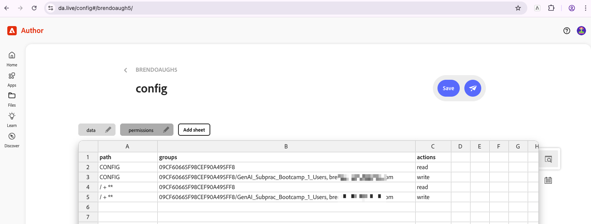

3. Click Save (paper plane)

#### Confirm now that IMS user group users can now author content in DA

Now that we have opened up DA permissions again (albeit to a limited group `GenAI_Subprac_Bootcamp_1_Users`), login to DA in another browser profile with your adobe user (with the `acs-apac-internal` profile).  This user has been pre-added into the user group for the purposes of this bootcamp.  Try author and save changes to content in DA again.  You should be able to.

> Remember preview and publish permisssion is still restricted to these users.


## Checkpoint

At this point you should have an understanding of the concepts that drive DA and EDS permissions.  We have experimented with authoring, previewing and publishing of content from DA to EDS, firstly with open access, then with restricted access in DA and in EDS.  However this was quite manual and does not scale that well for use cases where:

- IMS user group user association change often
- you have large number of DA/EDS sites to manage
- you have a large number of users and/or groups of users
- automation is required

Next we will move onto automating this configuration at scale.

## Create App Builder App

### Sign in from the CLI

```
aio login
```

A browser window should open, asking you to sign in with your Adobe ID.

Login with your corporate Adobe ID (e.g. downes@adobe.com) as this will be needed for you to create an App Builder app within the `acs-apac-internal` org.  

Select the `acs-apac-internal` profile.

If prompted, click on the "proceed" link.


Once you've logged in, you can close the browser window and go back to Terminal. 


> For more information on signing in from the cli, see https://developer.adobe.com/app-builder/docs/get_started/app_builder_get_started/first-app#sign-in-from-the-cli

### Create the project in Developer Console

Go to Adobe Developer Console https://developer.adobe.com/console

Select the `acs-apac-internal` org.

Click "Create project from template"

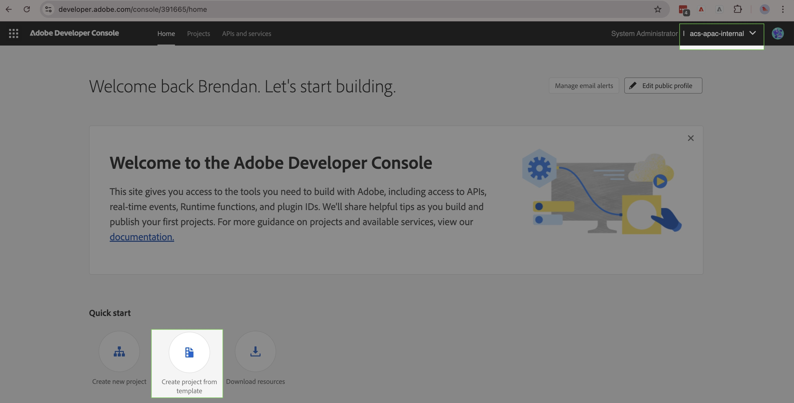

Choose Adobe App Builder

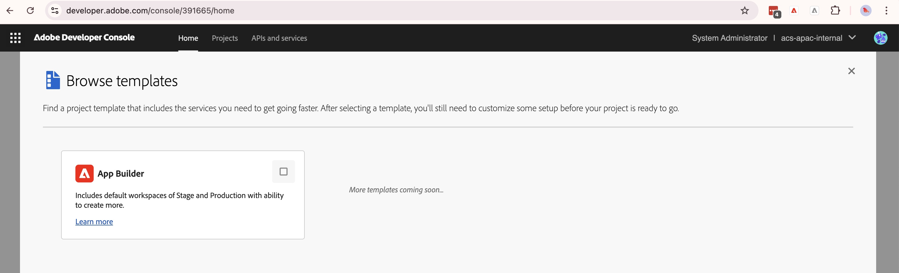

Give the project a title (e.g. `brendanbc2`).  Ensure you keep checked "Include Runtime".  Click Save.

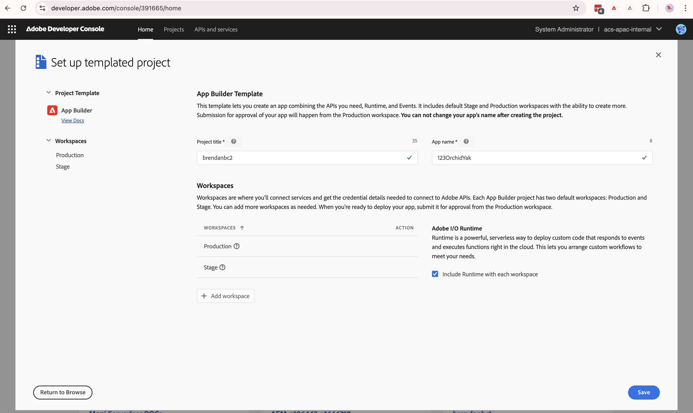


> For more information, see https://developer.adobe.com/app-builder/docs/get_started/app_builder_get_started/first-app#create-a-new-project-on-developer-console

### Generate the App Builder project locally

Create a folder on your local

```
mkdir 
cd brendanbc2
```

Bootstrap the new app using the CLI

```
aio app init brendanbc2app --standalone-app
```

You will be prompted with a few questions about how you want your app to be boostrapped and configured.

When prompted:

- Select org - `acs-apac-internal`
- Select project - `<Your project name from above>`
- Select features to enable - Actions only.
  - Sample actions - `Generic`
    - Name of sample application - `generic`


> For more information, see https://developer.adobe.com/app-builder/docs/get_started/app_builder_get_started/first-app#initialize-an-empty-project

### Open project in IDE

Feel free at this point to open your local App Builder project in an IDE.

## Implement Lab 1 Actions

> For more information on App Builder actions and their configuration please see https://developer.adobe.com/app-builder/docs/guides/app_builder_guides/configuration/configuration and https://developer.adobe.com/app-builder/docs/guides/app_builder_guides/configuration/configuration

Recall what we are about to create via AppBuilder


We will be creating 3 App Builder runtime actions

1. `get-umapi-users` - This action will fetch users from a predefined IMS user group
2. `update-eds-access` - This action will perform updates to the EDS configuration service to set access for previewing and publishing
3.  `sync-umapi-to-eds` - A main action that wires the first two actions together.  This is the the entry point.

### Define actions via `app.config.yaml`

Open `app.config.yaml`

You will see that this currently only defines the `generic` action.

Add the three new actions under the `actions` (just below the `generic` action). Refer to [lab1_sample_code/actions.yaml](lab1_sample_code/actions.yaml) for the action definitions.

### Define actions inputs via `app.config.yaml`

Open `app.config.yaml`

Add the inputs under the app parent

Refer to [lab1_sample_code/inputs.yaml](lab1_sample_code/inputs.yaml) for the action definitions.

### Check

Your `app.config.yaml` should now look something like this...


### Set env vars

> For more information on the `.env`file see https://developer.adobe.com/app-builder/docs/guides/app_builder_guides/configuration/configuration#the-env-file

Set env vars in `.env` file:

- EDS_ORG
- EDS_SITE
- EDS_ADMIN_TOKEN
- UMAPI_PROXY_URL

Example

```
...
EDS_ORG=<ORG>
EDS_SITE=<SITE>
EDS_ADMIN_TOKEN=<X_AUTH_TOKEN>
UMAPI_PROXY_URL=https://391665-478whitegayal-stage.adobeioruntime.net/api/v1/web/umapi-proxy-app/umapi-proxy-action?secret=<PROXY_SECRET>
```

where:

- ORG is your EDS org from earlier in this lab
- SITE is your EDS site from earlier in this lab
- X_AUTH_TOKEN is your x_auth_token from earlier in this lab
- PROXY_SECRET will be given to you in the lab

> For this lab, we will not actually be calling the UMAPI API, as there are strict rate limits that would be exceeded if we did.  Instead we are mocking this data, hence the UMAPI_PROXY_URL, which is because we are using a proxy endpoint that is sending back mock data.

### Add action code for get-umapi-users

Add the `get-umapi-users` action code to new file called `actions/get-umapi-users/index.js`

Example code can be found [lab1_sample_code/get-umapi-users/index.js](lab1_sample_code/get-umapi-users/index.js)

### Add action code for update-eds-access

Add the `update-eds-access` action code to new file called `actions/update-eds-access/index.js`

Example code can be found [lab1_sample_code/update-eds-access/index.js](lab1_sample_code/update-eds-access/index.js)

### Add action code for sync-umapi-to-eds

Add the `sync-umapi-to-eds` action code to new file called `actions/sync-umapi-to-eds/index.js`

Example code can be found [lab1_sample_code/sync-umapi-to-eds/index.js](lab1_sample_code/sync-umapi-to-eds/index.js)

## Deploy Lab 1 actions

```
cd <appfolder>
aio app deploy
```


Take note of all the web action URLs

## Verify `get-umapi-users` action

Execute the web action for the action via curl

```
curl "https://391665-123orchidyak-stage.adobeioruntime.net/api/v1/web/brendanbc2app/get-umapi-users"
```

You should see the IMS group users returned

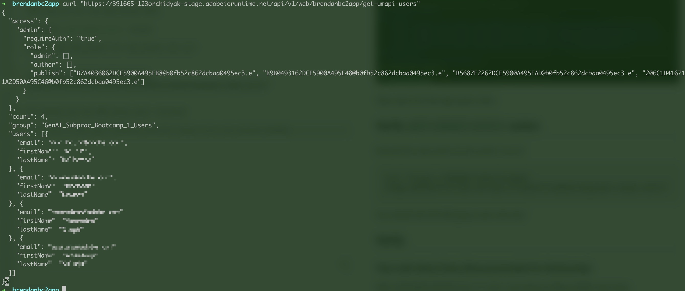

## Execute `sync-umapi-to-eds` to set EDS preview and publishing permissions

This is App Builder action that is the automation we have been aiming for, which will loop all users in an IMS group and set EDS preview and publishing permissions.

This can be run on a schedule, in order to continuosly update EDS access control as required as users come and go within an organization.


```
curl https://391665-123orchidyak-stage.adobeioruntime.net/api/v1/web/brendanbc2app/sync-umapi-to-eds
```

You should see `access.json updated successfully`

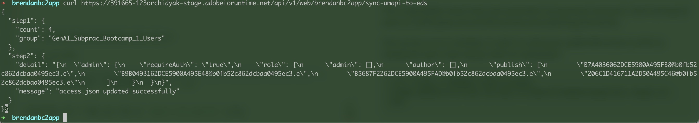

## Verify EDS permissions were set

Use the same curl command from the ["Confirm current EDS site access"](#confirm-current-eds-site-access) section:

curl 'https://admin.hlx.page/config/<ORG>/sites/<SITE>/access.json' \
--header 'x-auth-token: <AUTH_TOKEN>'

You should see all IMS user IDs in the publish array

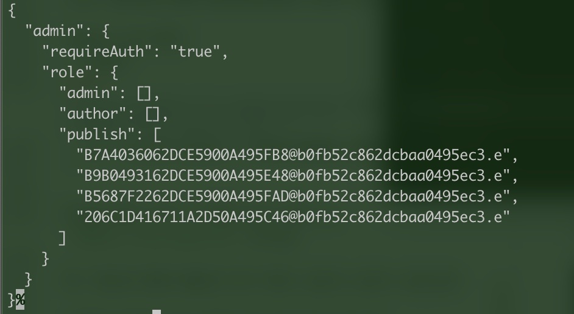

## Test Publishing from DA to EDS again

Repeat the same test as in ["Confirm now that IMS user group users can now author content in DA"](#confirm-now-that-ims-user-group-users-can-now-author-content-in-da):

Login to DA in another browser profile with your adobe user (with the `acs-apac-internal` profile). This time, attempt to **preview and publish** content.


You should now be able to successfully publish this time! 

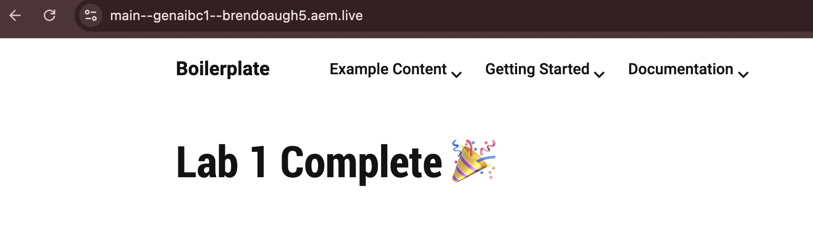

The automated sync action has granted publish permissions to all users in the `GenAI_Subprac_Bootcamp_1_Users` group.

If you are able to successfully publish then you have successfully completed the lab!

**Lab 1 Complete 🎉**
---

## Lab 2: AI Asset Tagging with Azure OpenAI

Ready to add AI-powered asset tagging to your application? 

👉 **[Follow the detailed Lab 2 Setup Guide →](AI_ASSET_TAGGING_SETUP.md)**

### Lab 2 Overview

In Lab 2, you'll learn to:
- ✅ Add AI-powered metadata generation using Azure OpenAI GPT-4 Vision
- ✅ Integrate with AEM Cloud Service for asset processing
- ✅ Deploy serverless actions with optimized memory and timeout settings
- ✅ Test the AI asset tagging workflow end-to-end

### What You'll Build

Two new serverless actions:
1. **`ai-asset-tagging`** - REST API endpoint for on-demand AI asset tagging
2. **`worker`** - Asset Compute worker for batch processing

The complete step-by-step guide includes:
- Creating action folders and files
- Updating configuration files (`app.config.yaml`, `.env`)
- Adding required dependencies
- Deployment commands
- Testing instructions
- Troubleshooting guide

**[📖 Start Lab 2 Setup Guide](AI_ASSET_TAGGING_SETUP.md)**