# APAC C&C GenAI Sub-practice - Bootcamp 1 - Lab 1

## Lab 1 Overview

In this lab, you will:

1. Create an AEM Edge Delivery Services (EDS) site, using Document Authoring (DA) for the  content authoring method.
2. Harden DA to restrict authoring to only an admin + specific users from an IMS group.
3. Harden EDS to restrict preview and publishing to only an admin + specific users from an IMS group.
4. Utilize App Builder to create runtime actions that will leverage the [UMAPI API](https://developer.adobe.com/umapi/) and the [AEM Admin API](https://www.aem.live/docs/admin.html) to automate the hardening of preview and publishing permissions to users from a specific IMS group.

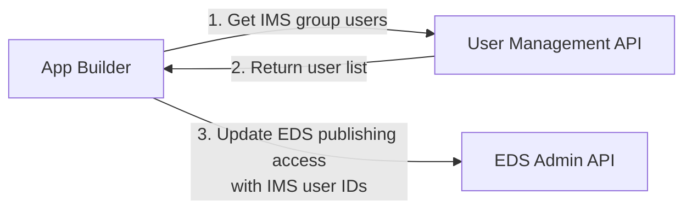

## Key Resources

### AEM Edge Delivery Services (EDS)
- [EDS Getting Started Tutorial](https://www.aem.live/developer/tutorial) - Complete setup guide
- [EDS Admin API](https://www.aem.live/docs/admin.html) - API for managing site permissions
- [EDS User Admin Tool](https://tools.aem.live) - Web UI for managing site access

### Document Authoring (DA)
- [DA Authoring Interface](https://da.live) - Content editing platform
- [DA Permissions Guide](https://docs.da.live/administrators/guides/permissions) - Configure user access and roles

### Adobe App Builder
- [Getting Started with Runtime](https://developer.adobe.com/app-builder/docs/get_started/runtime_getting_started) - App Builder basics
- [Node.js Runtime Versions](https://developer.adobe.com/app-builder/docs/guides/runtime_guides/reference_docs/runtimes) - Supported Node.js versions
- [Developer Console](https://developer.adobe.com/console) - Create and manage App Builder projects

### User Management API (UMAPI)
- [UMAPI Overview](https://developer.adobe.com/umapi/) - Getting started with User Management API
- [UMAPI Documentation](https://adobe-apiplatform.github.io/umapi-documentation/en/) - Complete API reference

### GitHub Resources
- [AEM Boilerplate Template](https://github.com/adobe/aem-boilerplate) - Starter template for EDS sites
- [AEM Code Sync App](https://github.com/apps/aem-code-sync) - Required GitHub app for EDS integration

## Prerequisites

### Install Node.js and npm

Node.js version 20.7.0 or higher is required for Adobe App Builder. npm comes bundled with Node.js.

> **Note:** Adobe App Builder officially supports the three latest Node.js versions (20, 22, 24). See [official runtime documentation](https://developer.adobe.com/app-builder/docs/guides/runtime_guides/reference_docs/runtimes) for the current supported versions.

#### Mac Installation

**Option 1: Using Homebrew (Recommended)**

```bash
# Install Homebrew if you don't have it
/bin/bash -c "$(curl -fsSL https://raw.githubusercontent.com/Homebrew/install/HEAD/install.sh)"

# Install Node.js (includes npm)
brew install node@20

# Verify installation
node --version
npm --version
```

**Option 2: Using Official Installer**

1. Go to [https://nodejs.org/](https://nodejs.org/)
2. Download the LTS (Long Term Support) version for macOS
3. Run the installer and follow the prompts
4. Open Terminal and verify:

```bash
node --version
npm --version
```

#### Windows Installation

**Using Official Installer**

1. Go to [https://nodejs.org/](https://nodejs.org/)
2. Download the LTS (Long Term Support) version for Windows
3. Run the `.msi` installer
4. Follow the installation wizard (use default settings)
5. Open Command Prompt or PowerShell and verify:

```bash
node --version
npm --version
```

**Note:** You may need to restart your terminal/command prompt after installation for the commands to be recognized.

### Install Adobe I/O CLI (aio)

Install the `aio` CLI globally using npm:

```bash
npm install -g @adobe/aio-cli
```

Verify the installation:

```bash
aio --version
```

> See the [official setup guide](https://developer.adobe.com/app-builder/docs/get_started/runtime_getting_started/setup) for more details on configuring the CLI.

## Create Document Authoring (DA) and Edge Delivery Services (EDS) AEM project

Go to https://www.aem.live/

Click **Create your site**

You end up here https://www.aem.live/developer/tutorial.  Follow this tutorial.

### Create boilerplate GitHub repo

Sign up for new github account or use an existing.

Clone the boilerplate GitHub repo [https://github.com/adobe/aem-boilerplate](https://github.com/adobe/aem-boilerplate)

Click the `Use this template button` and select `Create a new repository`, and select the user org that owns the repository


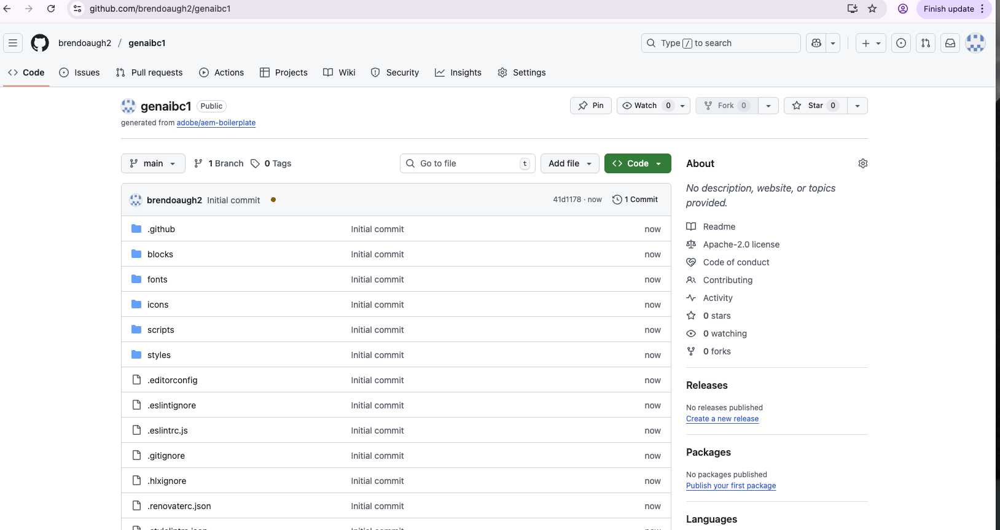

Set repo to public.

Click Create repository

### Install AEM Code Sync

Install the [AEM Code Sync](https://github.com/apps/aem-code-sync) on your repository.
    


In the `Repository access` settings of the AEM Code Sync App, make sure you select `Only select Repositories` (not `All Repositories`). Then select your newly created repository, and click `Save`.

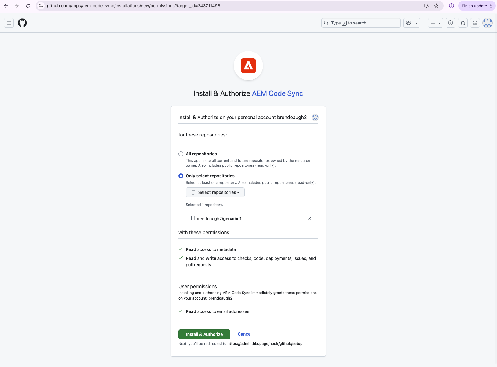
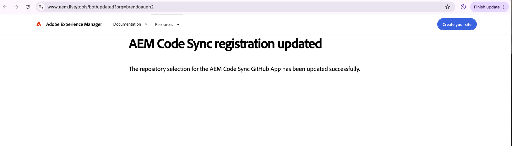

Congratulations! You have a new EDS website running on `https://<branch>--<repo>--<owner>.aem.page/`.  Check it is running.  In the example above that’s https://main--genaibc1--brendoaugh2.aem.page and https://main--genaibc1--brendoaugh2.aem.live


### What Just Happened: EDS Organization Setup

As part of the process you just followed, an `aem.live` EDS org with the same name as your `github.com` org was created, and the github.com user who added the AEM Code Sync App will be added as admin.

> See the [EDS Organization Setup Guide](https://www.aem.live/docs/config-service-setup#create-your-organization) for more details.

**Configuration Service** - It's important to know that there is a [Configuration Service](https://www.aem.live/docs/config-service-setup) used to manage various configurations in the EDS architecture. Common configuration tasks can be achieved using the [User Admin Tool](https://tools.aem.live/), however the same configuration can also be managed via the [AEM Admin API](https://www.aem.live/docs/admin.html#tag/orgConfig).

### Edit, Preview and Publish Content in Document Authoring

Navigate to https://da.live.

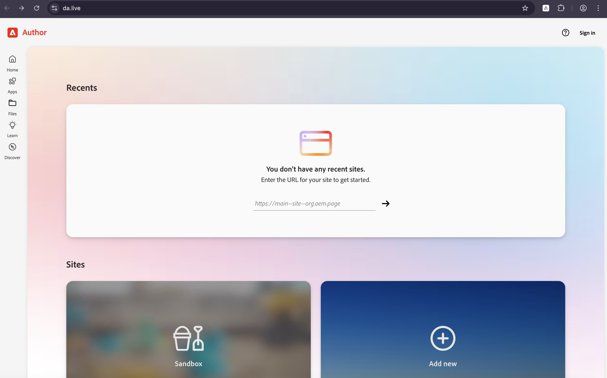

Click Sign in

  

> **Important:** At this point, the only admin user for your EDS org is the GitHub user who installed the AEM Code Sync App (as mentioned earlier). You must sign in with an Adobe account that corresponds to this GitHub user. If you don't have a matching Adobe account, you will need to create one.

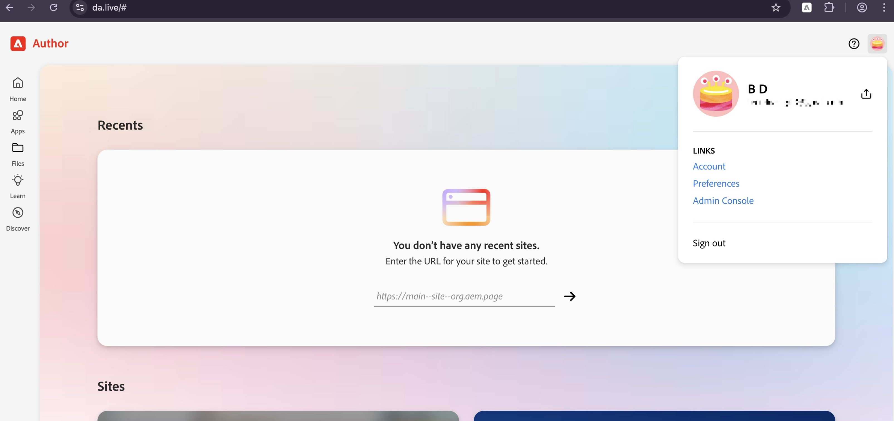

Enter the URL for your site to get started - in the format https://main--site--org.aem.page as your created EDS site URL above.  Click ->


If already have other recent DA sites, then enter the EDS site URL as shown below.  Click ->

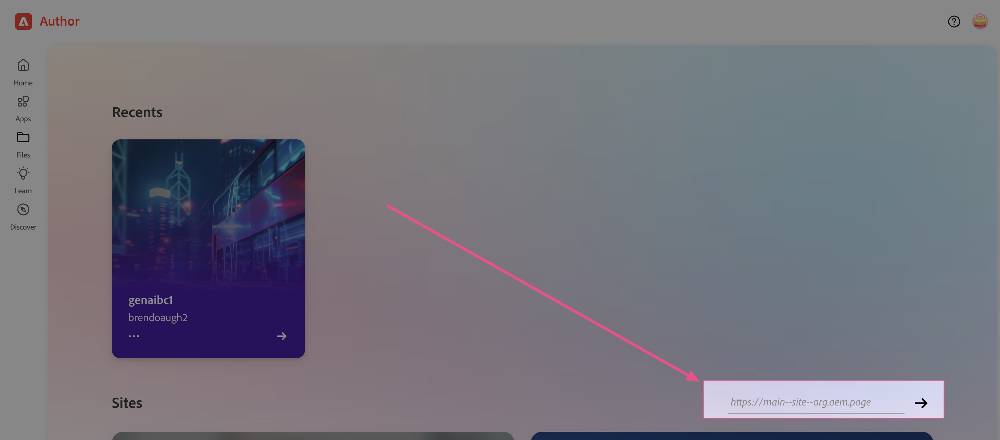

You will now see the DA authoring page for your site

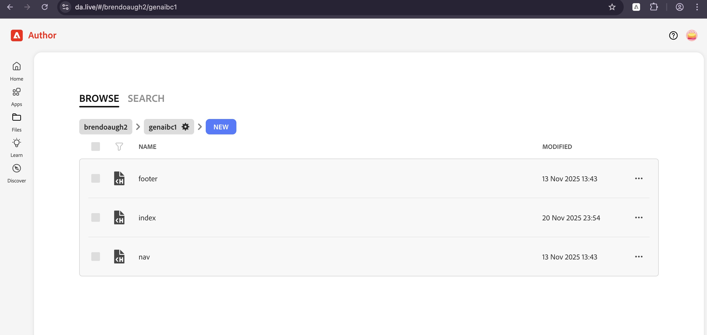

Edit the index page content.  For more information on authoring see https://da.live/docs.


Preview and Publish


You will see preview content pushed to the `.page` EDS site and published content pushed to `.live` EDS site.


### What Just Happened: DA and EDS Permissions

At this point, any user can log in to DA and author content for this site. Additionally, any user can preview and publish content to EDS.

To prove this, ask one of your bootcamp colleagues to browse to your DA authoring URL, update content and then try to preview and publish. They will be able to!

For an overview of the EDS ecosystem of access control, read https://docs.da.live/administrators/guides/permissions

### Setup and limit the ability to author content

> For concepts please read -> https://docs.da.live/administrators/guides/permissions#ability-to-author-content

Get your IMS Organization ID.  Use Admin Console to get your IMS organization ID.

> The ID for `acs-apac-internal` is `09CF60665F98CEF90A495FF8`

In your the permissions sheet of the DA organization config (https://da.live/config#/name-of-org/),
add the following configuration.

1. Add a sheet called `Permissions`.
2. Add columns `path`,  `groups` and `actions`

Populate the sheet as below.  NB the mix of org id and email only identities.  We are going to begin granting users of the `acs-apac-internal` org access to author in DA.  However we also don't want to blow away the existing access that exists for the email based identity (your github email) that was used to create the DA.

| **path** | **groups** | **actions** |
| -------- | ---------- | ----------- |
| CONFIG | `4E0722F969166E3E0A495F98, <gh_email>` | write |
| / + ** | `4E0722F969166E3E0A495F98, <gh_email>` | write |

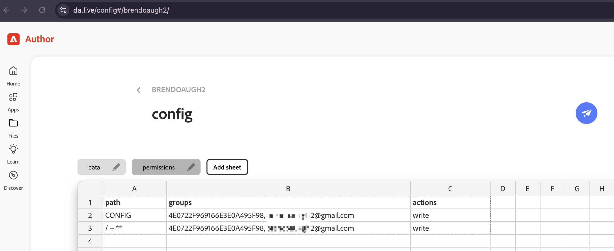

3. Click Save (paper plane)

### Setup and limit the ability to preview and publish

https://docs.da.live/administrators/guides/permissions#setup-and-limit-the-ability-to-preview-and-publish


### Harden DA permissions

https://docs.da.live/administrators/guides/permissions

1. Add your admin user to DA permissions (config and authoring)
2. Add all users from IMS Group ??? in `acs-apac-internal` group to DA permissions (config and authoring)

> At this point the admin user and anyone in the IMS group will be able to author in DA, but not preview or publish!

### Harden EDS permissions

#### View current state of EDS site access using EDS Admin API

#### Restrict access to specific user

#### Verify only this user can preview publish and others cannot

> At this point you should have an understanding of the concepts that drive DA and EDS permissions.  Next we will move onto automating this configuration at scale.

## Create App Builder App

### Sign in from the CLI

```
aio login
```

A browser window should open, asking you to sign in with your Adobe ID. 

Once you've logged in, you can close the browser window and go back to Terminal. 


### Create the project in Developer Console

1.	Go to Adobe Developer Console https://developer.adobe.com/console
2.  Go to `acs-apac-internal` org.
3.  Click “Create project from template”
4.  Choose Adobe App Builder
5. Give the project a title (e.g. brendanbc1).  Ensure you keep checked "Include Runtime".  Click Save.
    
### Generate the App Builder project locally

NB: There is a sample project build locally under `genaispbc1` which you can reference (TODO, COULD PUT THIS IN SOLUTION BRANCH INSTEAD)

Create a folder on your local
You will be prompted with a few questions about how you want your app to be boostrapped and configured.

```
mkdir genaispbc1
cd genaispbc1

aio app init genaispbc1 --standalone-app
```

When prompted:

- Select org - `acs-apac-internal`
- Select project - `<Your project name from above>`
- Select features to enable - Actions only.
  - Sample actions - `Generic`
    - Name of sample application - `generic`

## Implement Lab 1 Actions

### Define actions via `app.config.yaml` under `actions`

```
get-umapi-users:
  function: actions/get-umapi-users/index.js
  web: 'yes'
  runtime: nodejs:22
  inputs:
    LOG_LEVEL: debug
  annotations:
    require-adobe-auth: false
    final: true
update-eds-access:
  function: actions/update-eds-access/index.js
  web: 'yes'
  runtime: nodejs:22
  inputs:
    LOG_LEVEL: debug
  annotations:
    require-adobe-auth: false
    final: true
sync-umapi-to-eds:
  function: actions/sync-umapi-to-eds/index.js
  web: 'yes'
  runtime: nodejs:22
  inputs:
    LOG_LEVEL: debug
  annotations:
    require-adobe-auth: false
    final: true
```

### Define actions inputs via `app.config.yaml` below `actions`

```
inputs:
  # EDS configuration
  EDS_ORG: $EDS_ORG
  EDS_SITE: $EDS_SITE
  EDS_ADMIN_TOKEN: $EDS_ADMIN_TOKEN
  # UMAPI proxy
  UMAPI_PROXY_URL: $UMAPI_PROXY_URL
```

### Set env vars

Set env vars in `.env` file: EDS_ORG, EDS_SITE, EDS_ADMIN_TOKEN, UMAPI_PROXY_URL, USE_MOCK_DATA

Example

```
UMAPI_PROXY_URL=https://391665-478whitegayal-stage.adobeioruntime.net/api/v1/web/umapi-proxy-app/umapi-proxy-action?secret=<ASK>
EDS_ORG=brendoaugh2
EDS_SITE=genaibc1
EDS_ADMIN_TOKEN=

# Use mock UMAPI data to avoid rate limits (set to 'true' for bootcamp)
# UMAPI has a limit of 25 requests/minute. With 30 attendees, mock data avoids rate limit issues.
# Mock data is based on real EDS_Sandbox_Users group and only changes once daily.
USE_MOCK_DATA=true
```

**Important:** During the bootcamp, keep `USE_MOCK_DATA=true` to avoid UMAPI rate limits (25 req/min). With 30 attendees, everyone would hit rate limits testing simultaneously. Set to `false` only for production use or when you need live data.

### Add action code for get-umapi-users

Add to actions/get-umapi-users/index.js (see example code in genaispbc1 folder)

### Add action code for update-eds-access

Add to actions/update-eds-access/index.js (see example code in genaispbc1 folder)

### Add action code for sync-umapi-to-eds

Add to actions/sync-umapi-to-eds/index.js (see example code in genaispbc1 folder)

## Deploy Lab 1 actions

```
aio app deploy
```

## Verify

### Test with Mock Data (Recommended for Bootcamp)

With `USE_MOCK_DATA=true` in `.env`, test without hitting UMAPI rate limits:

**1. Test get-umapi-users:**
```bash
curl "https://391665-885ivorypike-stage.adobeioruntime.net/api/v1/web/genaispbc1/get-umapi-users" | jq '{_mock, group, count, access}'
```

Expected: `_mock: true`, 7 users from EDS_Sandbox_Users group

**2. Test sync-umapi-to-eds (End-to-End):**
```bash
curl "https://391665-885ivorypike-stage.adobeioruntime.net/api/v1/web/genaispbc1/sync-umapi-to-eds" | jq .
```

Expected: Both steps succeed (requires EDS_ADMIN_TOKEN in .env)
```json
{
  "step1": {
    "group": "EDS_Sandbox_Users",
    "count": 7
  },
  "step2": {
    "message": "access.json updated successfully"
  }
}
```

**3. Verify EDS permissions were set:**

Check via API:
```bash
curl "https://admin.hlx.page/config/<YOUR_ORG>/sites/<YOUR_SITE>/access.json" \
  -H "x-auth-token: <YOUR_ADMIN_TOKEN>" | jq .
```

Expected: All 7 IMS user IDs in `admin.role.publish` array

Or check EDS Admin UI that users were synced:

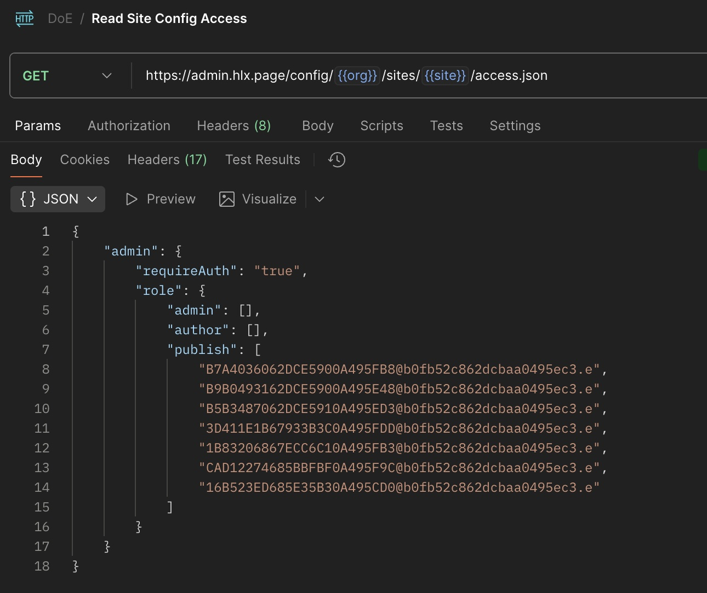

**4. Test Publishing:**

Verify you can publish site from DA authoring interface:


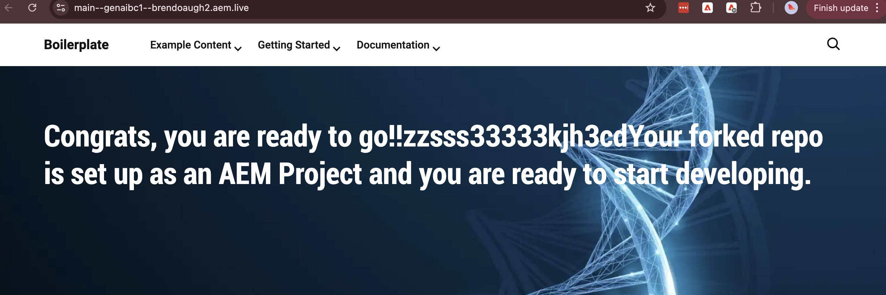

### Test with Live Data (Optional)

Set `USE_MOCK_DATA=false` in `.env` and redeploy to use live UMAPI data. Note: 25 req/min rate limit applies.

🎉🎉🎉 LAB Complete

